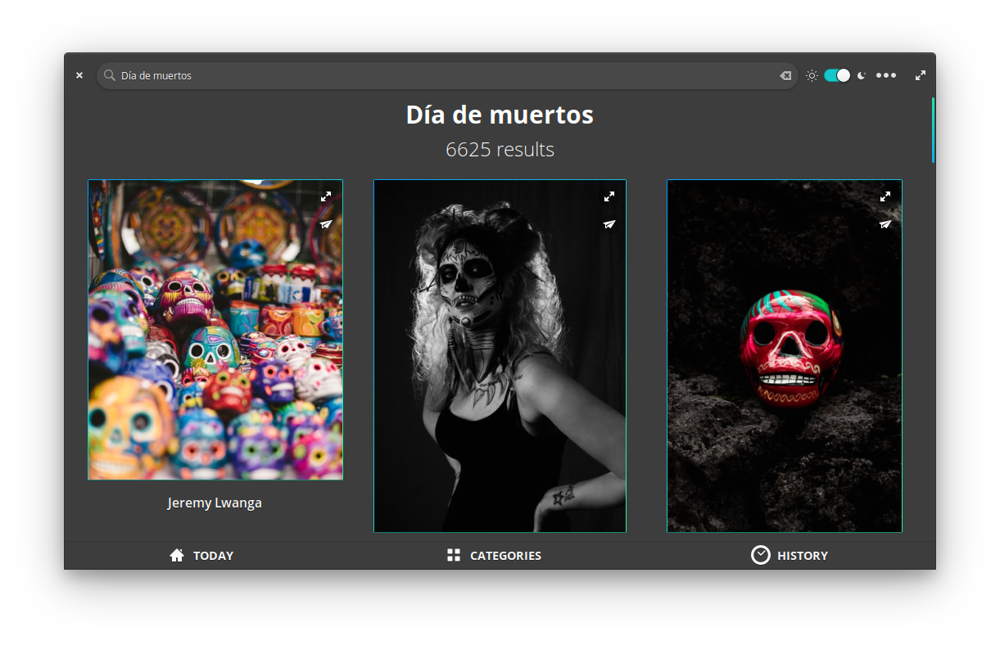
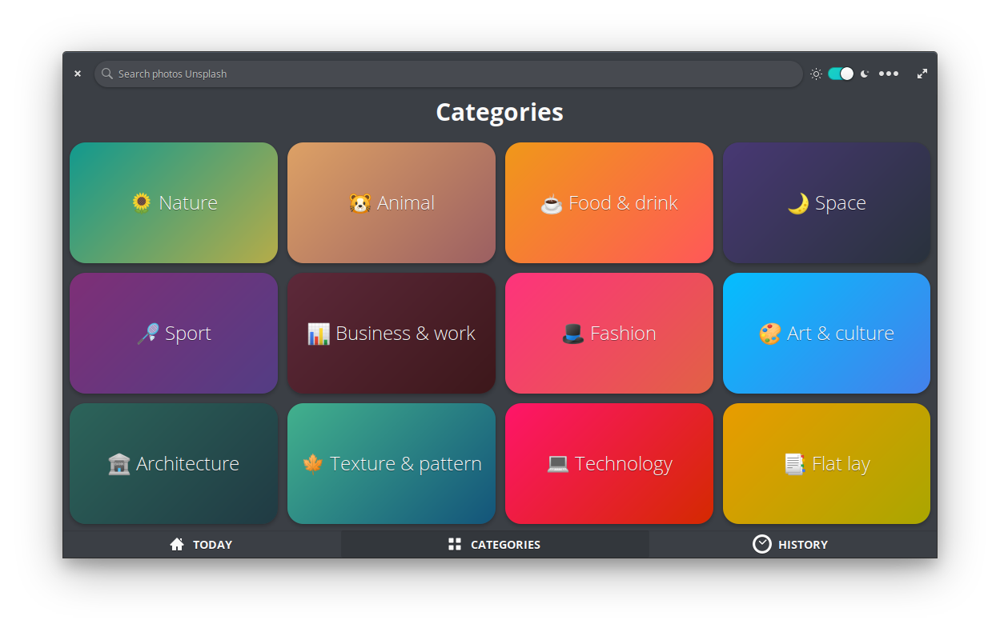
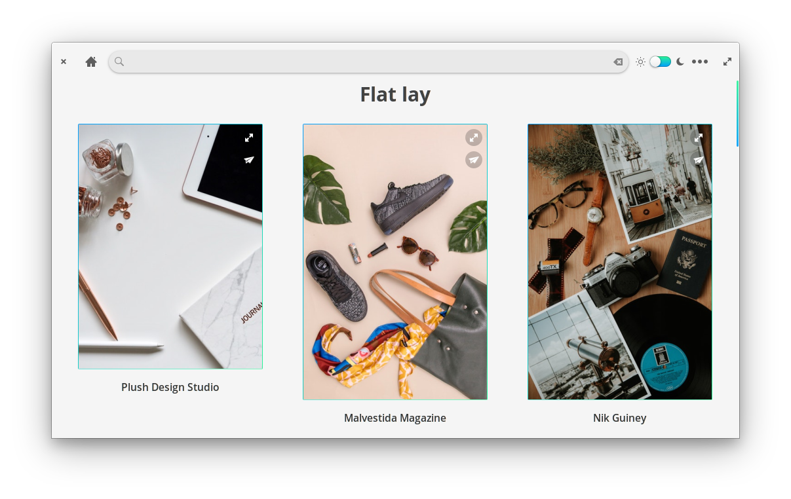
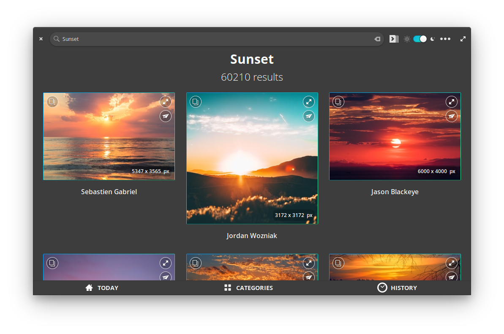
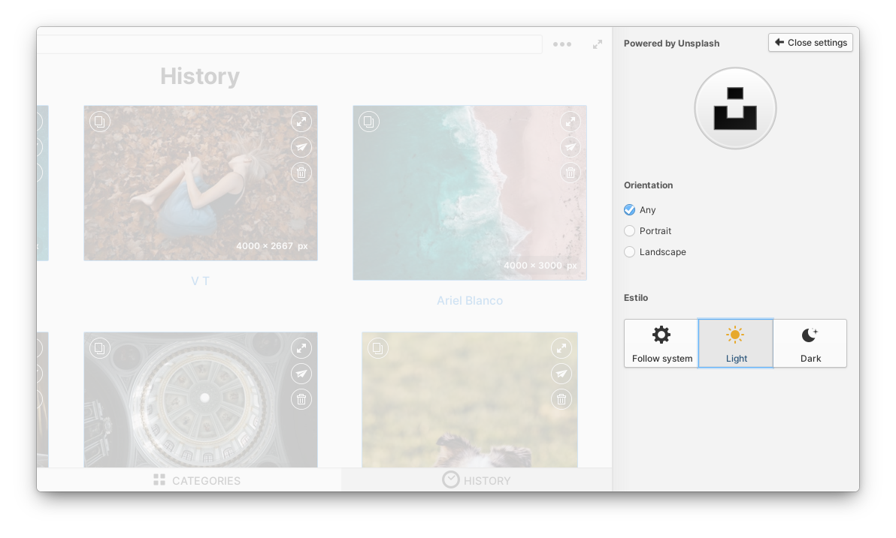

<div align="center">
  <span align="center"> </span>
  <h1 align="center">Fondo</h1>
  <h3 align="center"></h3>
</div>

<br/>

<p align="center">
    <a href="https://appcenter.elementary.io/com.github.calo001.fondo" target="_blank">
        
    </a>
    <a href='https://flathub.org/apps/details/com.github.calo001.fondo' target="_blank"></a>
</p>

<p align="center">
  <a href="https://github.com/calo001/fondo">
    
  </a>
  <a href="https://github.com/calo001/fondo/blob/master/LICENSE.md">
    
  </a>
  <a href="https://travis-ci.org/calo001/fondo">
    
  </a>
</p>

<p align="center">
    
    <table>
      <tr>
        <td>
          
        </td>
        <td>
          
        </td>
        <td>
          
        </td>
        <td>
          
        </td>
      </tr>
    </table>
</p>
<p align="center">
  <a href="https://github.com/calo001/fondo/issues/new">📬️ Report a problem!</a>
</p>

## 💻️ Installation

### 🔖️ Dependencies
These dependencies must be present before building:
 - `meson`
 - `valac`
 - `libgranite-dev`
 - `libgtk-3-dev`
 - `libjson-glib-dev`
 - `libsoup2.4-dev`


Use the App script to simplify installation by running `./app install-deps`, in this case, make sure that `dpkg-dev` package is installed
 
 ### 🛠️ Building

```
git clone https://github.com/calo001/fondo.git && cd fondo
./app install-deps && ./app install
```

### 🗑️ Deconstruct

```
./app uninstall
```

### 👨‍💻️ Development

Fondo includes a script to simplify the development process. This script can be accessed in the main project directory through `./app`.

```
Usage:
  ./app [OPTION]

Options:
  clean             Removes build directories (can require sudo)
  generate-i18n     Generates .pot and .po files for i18n (multi-language support)
  install           Builds and installs application to the system (requires sudo)
  install-deps      Installs missing build dependencies
  run               Builds and runs the application
  uninstall         Removes the application from the system (requires sudo)
```

## 🍵️ Support me

Fondo is and will always be free for the world 🌎️. If you like the project and would like to fund and contribute to my work, you can do it via Patreon or Paypal.Me:

<table>
  <tr>
    <td style="border: none; padding: 0;">
      <a href="https://www.paypal.me/calo001" target="_blank">
        
        </a>
    </td>
    <td style="border: none; padding: 0;">
      <a href="https://www.patreon.com/carloslr" target="_blank">
        
      </a>
    </td>
  </tr>
</table>

## 💜️ Special thanks

<p align="center">
  <a href="http://unsplash.com" target="_blank">
    
  </a>
</p>
<p align="center">
Beautiful, free photos.
Gifted by the world’s most generous community of photographers. 🎁
</p>

### 💞️ Support, help & inspiration

-  [Víctor Fernández](https://github.com/vfrico) for your appreciable help in the implementation of the slideshow wallpaper feature!
-  [KJ Lawrence](https://github.com/kjlaw89) for making easier the development of apps for elementary OS with [Archetype](https://appcenter.elementary.io/com.github.kjlaw89.archetype/)
-  [Cassidy James Blaede](https://github.com/cassidyjames) for his apps to use as code examples
-  [Daniel Foré](https://github.com/danrabbit) for his help in the google + community
-  [Ricardho](https://github.com/ricdev2) ideas, support and UX
-  [Andres Lopez](https://github.com/andreslopezrm) ideas and support
-  [VeckCol](https://github.com/VeckCol) ideas, support and translations

### 📦️ Flatpak maintainers
-  [Bilal Elmoussaoui](https://github.com/bilelmoussaoui)
-  [Yi-Soo An](https://github.com/memnoth)

### 🔤️ Translators
-  [Rafael C. Nunes](https://github.com/rafaelcn) Brazilian Portuguese
-  [costaht](https://github.com/costaht) Brazilian Portuguese
-  [NathanBnm](https://github.com/NathanBnm) French
-  [Heimen Stoffels](https://github.com/Vistaus) Dutch (Netherlands)
-  [Onno Giesmann](https://github.com/Etamuk) Turkish and German
-  [Milo Ivir](https://github.com/milotype) Croatian
-  [Albano Battistella](https://github.com/albanobattistella) Italian
-  [André Barata](https://github.com/rottenpants466) Portuguese Portugal

### 🗃️ Extra contributions
-  [Marius Meisenzahl](https://github.com/meisenzahl)
-  [Tomas Bulva](https://github.com/tomasbulva)
-  [WORLDofPEACE](https://github.com/worldofpeace)
-  [Natanael](https://github.com/sudo-give-me-coffee)
-  [Alain](https://github.com/alainm23)
- Many other amazing people!

Fondo is translated into several languages. If your language is missing or incomplete, please help to [translate](https://github.com/calo001/fondo/tree/master/po) Fondo into your language.

## 📜️ License

This project is licensed under the AGPL-3.0 License - see the [LICENSE](LICENSE.md) file for details.
